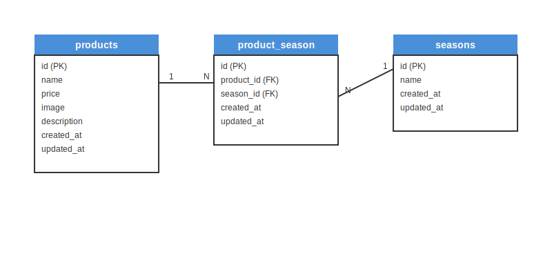

# mogitate（もぎたて）

フルーツ商品を管理するためのWebアプリケーションです。

## 環境構築

### Dockerビルド

```bash
https://github.com/bouzudaiou/coachtech-mogitate
cd coachtech-mogitate
docker-compose up -d --build
```

### Laravel環境構築

```bash
docker-compose exec php bash
composer install
cp .env.example .env
php artisan key:generate
php artisan migrate
php artisan db:seed
php artisan storage:link
```

## 使用技術（実行環境）

- PHP 8.1.34
- Laravel 10.50.0
- MariaDB 11.8.3
- nginx 1.21
- Docker / Docker Compose

## ER図



## URL

- 開発環境：http://localhost/
- 商品一覧：http://localhost/products
- 商品登録：http://localhost/products/register
- phpMyAdmin：http://localhost:8080/
